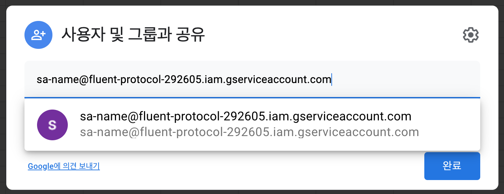

# rest-api-google-sheets

## REST APIs
- Google Cloud project: rest-api-google-sheets (Gitple Account)
- URL : https://sheets-on-run-fywh4w3uiq-du.a.run.app (Cloud Run)
- Shared Account: `sa-name@fluent-protocol-292605.iam.gserviceaccount.com`
  
- APIs

  * **`Params`**
    - sheet: google sheets ID
    - tab: google sheetss Tab Name
    - example
    ```
      https://sheets-on-run-fywh4w3uiq-du.a.run.app/cards?sheet=googlesheetsid&tab=tabname
    ```

  * **`GET` https://sheets-on-run-fywh4w3uiq-du.a.run.app/cards**
  
    - google sheets

    | label | value | image url |
    |---|:---|:---|
    | K-바비큐 | K-BBQ | https://sandwich-bot-data.s3.ap-northeast-2.amazonaws.com/sandwich_k-bbq.jpg |
    | 얼터밋 | Altermeat | https://sandwich-bot-data.s3.ap-northeast-2.amazonaws.com/sandwich_+Altermeat.jpg |

    - reponse
    ```json
    {
    "templateType": "basicCard",
    "data": [
        {
            "label": "K-바비큐aaa",
            "value": "K-BBQ",
            "image": "https://sandwich-bot-data.s3.ap-northeast-2.amazonaws.com/sandwich_k-bbq.jpg"
        },
        {
            "label": "얼터밋",
            "value": "Altermeat",
            "image": "https://sandwich-bot-data.s3.ap-northeast-2.amazonaws.com/sandwich_+Altermeat.jpg"
        }
      ]
    }
    ```

  * **`GET` https://sheets-on-run-fywh4w3uiq-du.a.run.app/lists**

    - google sheets

    | label | value |
    |---|:---|
    | K-바비큐 | K-BBQ |
    | 얼터밋 | Altermeat |

    - reponse
    ```json
    {
    "templateType": "list",
    "data": [
        {
            "label": "K-바비큐aaa",
            "value": "K-BBQ"
        },
        {
            "label": "얼터밋",
            "value": "Altermeat"
        }
      ]
    }
    ```

  * **`GET` https://sheets-on-run-fywh4w3uiq-du.a.run.app/data**

    - params
       - key: [optional] comma separated keys
       - value: [optional] comma separated values(AND operation), a value can be '|' separated(OR operation).

    - example: get a row matching (email == 'ys@x.com' OR 'jy@x.com') AND (avail == 'yes')
       - https://sheets-on-run-fywh4w3uiq-du.a.run.app/data?sheet=googlesheetsid&tab=tabname&key=email,avail&value=ys@x.com|jy@x.com,yes

    - google sheets

    | key | value |
    |---|:---|
    | key1 | value1 |
    | key2 | value2 |

    | key1 | key2 | ... | keyN |
    |---|:---|:---|:---|
    | row1_value1 | row1_value2 | ... | row1_valueN |
    | row2_value1 | row_value2 | ... | row2_valueN |

    - reponse
    ```json
    {
      "key1": "a_row_value1",
      "key2": "a_row_value2",
      ...
    }
    ``` 

  * **`POST` https://sheets-on-run-fywh4w3uiq-du.a.run.app/data**

    - body
    ```json
    {
      "key1": "value1",
      "key2": "value2",
    }
    ``` 

    - google sheets

    | | | | |
    |---|:---|:---|:---|
    | key1 | value1 | key2 | value2 |
    

## Create google cloud platform project
- enable billing: cloud run 서비스 사용을 위해서는 반드시 billing 정보 연동 필요
- created project name: rest-api-google-sheets 

## Install gcloud
- installation guide: https://cloud.google.com/sdk/docs/downloads-interactive
```bash
# initialize gcloud
gcloud init 

# set account
gcloud config set account '{gcloud account}'

# set project
gcloud config set project '{project id}'
```

- created project name: `rest-api-google-sheets`
- created project id: `fluent-protocol-292605`

## Download Credentials
```bash
# Get the current project
PROJECT=$(gcloud config get-value core/project 2> /dev/null)

# Create a service account (aka robot account)
gcloud iam service-accounts create sa-name \
  --description="sa-description" \
  --display-name="sa-display-name"

# Create and download credentials for the service account
gcloud iam service-accounts keys create creds.json \
  --iam-account sa-name@$PROJECT.iam.gserviceaccount.com

# Copy service account email
echo "sa-name@$PROJECT.iam.gserviceaccount.com" | pbcopy
```

- created credential id: `sa-name@fluent-protocol-292605.iam.gserviceaccount.com`

## Enable the Google Sheets API
```bash
gcloud services enable sheets.googleapis.com
```

## Deploy
- run `deploy.sh`
```bash
# get project id
GCP_PROJECT=$(gcloud config list --format 'value(core.project)' 2>/dev/null)

# build image
gcloud builds submit \
--tag gcr.io/$GCP_PROJECT/sheets-on-run

# set default region : seoul
gcloud config set run/region asia-northeast3

# deploy image
gcloud run deploy sheets-on-run \
--image gcr.io/$GCP_PROJECT/sheets-on-run \
--platform managed \
--allow-unauthenticated
```

## Development
- install packages
```bash
npm install
```
- run local
```bash
npm run dev
```
- deploy
```bash
./deploy.sh
```


