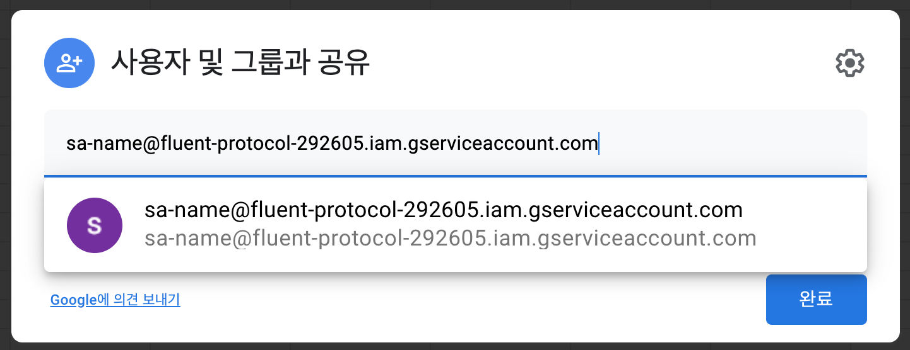

# rest-api-google-sheets

## Share Google sheet
- 구글 스프레드시트에 `sa-name@fluent-protocol-292605.iam.gserviceaccount.com`를 공유 사용자로 추가

## Bot-builder
- 봇빌더 `HTTP 선택노드`
  * 구글 스프레드시트에 있는 데이타를 선택 메뉴로 사용
  * 이미지가 포함된 카드형 메뉴 API
    - url: `https://sheets-on-run-fywh4w3uiq-du.a.run.app/cards`, 
    - method: `GET`
  * 이미지가 없는 리스트형 메뉴 API
    - url: `https://sheets-on-run-fywh4w3uiq-du.a.run.app/lists`
    - method: `GET`
  * 가이드: https://guide.gitple.io/#/bot-builder?id=http-%eb%a9%94%ec%8b%9c%ec%a7%80-%eb%85%b8%eb%93%9c

- 봇빌더 `HTTP 메세지 노드`
  * 구글 스프레드시트에 있는 데이타를 읽고 쓰기로 사용
  * 데이타 읽고 쓰기 APIs
    - url: `https://sheets-on-run-fywh4w3uiq-du.a.run.app/data`
    - method: `GET`, `PUT`, `POST`
  * 가이드: https://guide.gitple.io/#/bot-builder?id=http-%ec%84%a0%ed%83%9d-%eb%85%b8%eb%93%9c

## REST APIs
- Google Cloud project: rest-api-google-sheets (Gitple Account)
- URL : https://sheets-on-run-fywh4w3uiq-du.a.run.app (Cloud Run)
- Shared Account: `sa-name@fluent-protocol-292605.iam.gserviceaccount.com`
  
- APIs

  * **`Common params`**
    - sheet: google sheets ID
    - tab: google sheetss Tab Name
    - example
    ```
      https://sheets-on-run-fywh4w3uiq-du.a.run.app/cards?sheet=googlesheetsid&tab=tabname
    ```

  * **`Get select items with imaage`**
    - desc : Get card select items.
    - url: **https://sheets-on-run-fywh4w3uiq-du.a.run.app/cards**
    - method: `GET`
    - google sheets

      |   | A | B | C |
      |---|:---|:---|:---|
      | 1 | label | value | image url |
      | 2 | K-바비큐 | K-BBQ | https://sandwich-bot-data.s3.ap-northeast-2.amazonaws.com/sandwich_k-bbq.jpg |
      | 3 | 얼터밋 | Altermeat | https://sandwich-bot-data.s3.ap-northeast-2.amazonaws.com/sandwich_+Altermeat.jpg |


    - reponse
      ```json
      {
      "templateType": "basicCard",
      "data": [
          {
              "label": "K-바비큐aaa",
              "value": "K-BBQ",
              "image": "https://sandwich-bot-data.s3.ap-northeast-2.amazonaws.com/sandwich_k-bbq.jpg"
          },
          {
              "label": "얼터밋",
              "value": "Altermeat",
              "image": "https://sandwich-bot-data.s3.ap-northeast-2.amazonaws.com/sandwich_+Altermeat.jpg"
          }
        ]
      }
      ```

  * **`Get select item`**
    - desc : Get list select items.
    - url: **https://sheets-on-run-fywh4w3uiq-du.a.run.app/lists**
    - method: `GET`
    - google sheets

      |   | A | B |
      |---|:---|:---|
      | 1 | label | value |
      | 2 | K-바비큐 | K-BBQ |
      | 3 | 얼터밋 | Altermeat |


    - reponse
      ```json
      {
      "templateType": "list",
      "data": [
          {
              "label": "K-바비큐aaa",
              "value": "K-BBQ"
          },
          {
              "label": "얼터밋",
              "value": "Altermeat"
          }
        ]
      }
      ```

  * **`GET with query`**
    - desc : select the matched row or nothing.
    - url: **https://sheets-on-run-fywh4w3uiq-du.a.run.app/data**
    - method: `GET`
    - params
       - key: [optional] comma separated keys
       - value: [optional] comma separated values(AND operation), a value can be '|' separated(OR operation).
       - op: [optional] comma separated operations such as `gt`, `gte`, `lt`, `lte` and `eq`
          - `eq`: default if missing
          - `gt`, `gte`, `lt` and `lte`: `Number` conversion to the given value

    - example: get a row matching (email == `ys@x.com` OR `jy@x.com`) AND (avail < 1)
       - https://your_app.run.app/data?sheet=googlesheetsid&tab=tabname&key=email,avail&value=ys@x.com|jy@x.com,1&op=eq,lt

    - google sheets

    |   | A | B | C | ... | Z |
    |---|:---|:---|:---|:---|:---|
    | 1 | key1 | key2 | key3 | ... |  keyN
    | 2 | row2_value1 | row2_value2 | row2_value3 |... | row2_valueN |


    - reponse
    ```json
    {
      "row": "{row nummber}",
      "key1": "a_row_value1"
    }
    ``` 

  * **`Get with row ID`**
    - desc : Get row with row number.
    - url: **https://sheets-on-run-fywh4w3uiq-du.a.run.app/data**
    - method: `GET`
    - params
       - row: row ID(google spreadsheet row number)

    - google sheets

      |   | A | B | C | ... | Z |
      |---|:---|:---|:---|:---|:---|
      | 1 | key1 | key2 | key3 | ... |  keyN
      | 2 | row2_value1 | row2_value2 | row2_value3 |... | row2_valueN |
      | 3 | row3_value1 | row3_value2 | row3_value3 |... | row3_valueN |
      | 4 | row4_value1 | row4_value2 | row4_value3 |... | row4_valueN |


    - reponse

    ```json
    {
      "row": "{row nummber}",
      "key1": "a_row_value1",
      "key2": "a_row_value2",
      "key3": "a_row_value3",
      ...
      "keyN": "a_row_valueN",
    }
    ``` 

  * **`Update row with query`**
    - desc : Update the matched row.
    - url: **https://sheets-on-run-fywh4w3uiq-du.a.run.app/data**
    - method: `PUT`
    - parmas
      - key: [optional] comma separated keys
      - value: [optional] comma separated values(AND operation), a value can be '|' separated(OR operation).
      - op: [optional] comma separated operations such as `gt`, `gte`, `lt`, `lte` and `eq`
        - `eq`: default if missing
        - `gt`, `gte`, `lt` and `lte`: `Number` conversion to the given value
    - body
      ```json
      {
        "key2": "update_value2",
        "key3": "update_value3",
      }
      ``` 

    - google sheets

      |   | A | B | C | ... | Z |
      |---|:---|:---|:---|:---|:---|
      | 1 | key1 | key2 | key3 | ... |  keyN
      | 2 | value1 | update_value2 | update_value3 |... | valueN |

    - response
      ```json
      {
        "row": "{row number}",
        "key1": "value1",
        "key2": "update_value2",
        "key3": "update_value3",
        ...
        "keyN": "valueN",
      }
      ``` 

  * **`Update row with ID`**
    - desc : Update row with row number.
    - url: **https://sheets-on-run-fywh4w3uiq-du.a.run.app/data**
    - method: `PUT`
    - parmas
      - row: row ID(google spreadsheet row number)
    - body
      ```json
      {
        "key2": "update_value2",
        "key3": "update_value3",
      }
      ``` 

    - google sheets

      |   | A | B | C | ... | Z |
      |---|:---|:---|:---|:---|:---|
      | 1 | key1 | key2 | key3 | ... |  keyN
      | 2 | value1 | update_value2 | update_value3 |... | valueN |

    - response
      ```json
      {
        "row": "{row number}",
        "key1": "value1",
        "key2": "update_value2",
        "key3": "update_value3",
        ...
        "keyN": "valueN",
      }
      ``` 


  * **`Append new row`**
    - desc : Append new row.
    - url: **https://sheets-on-run-fywh4w3uiq-du.a.run.app/data**
    - method: `POST`
    - body
      ```json
      {
        "key1": "value1",
        "key2": "value2",
        "key3": "value3",
        ...
        "keyN": "valueN",
      }
      ``` 

    - google sheets

      |   | A | B | C | ... | Z |
      |---|:---|:---|:---|:---|:---|
      | 1 | key1 | key2 | key3 | ... |  keyN
      | 2 | value1 | value2 | value3 |... | valueN |

    - response
      ```json
      {
        "row": "{row number}",
        "key1": "value1",
        "key2": "value2",
        "key3": "value3",
        ...
        "keyN": "valueN",
      }
      ``` 
